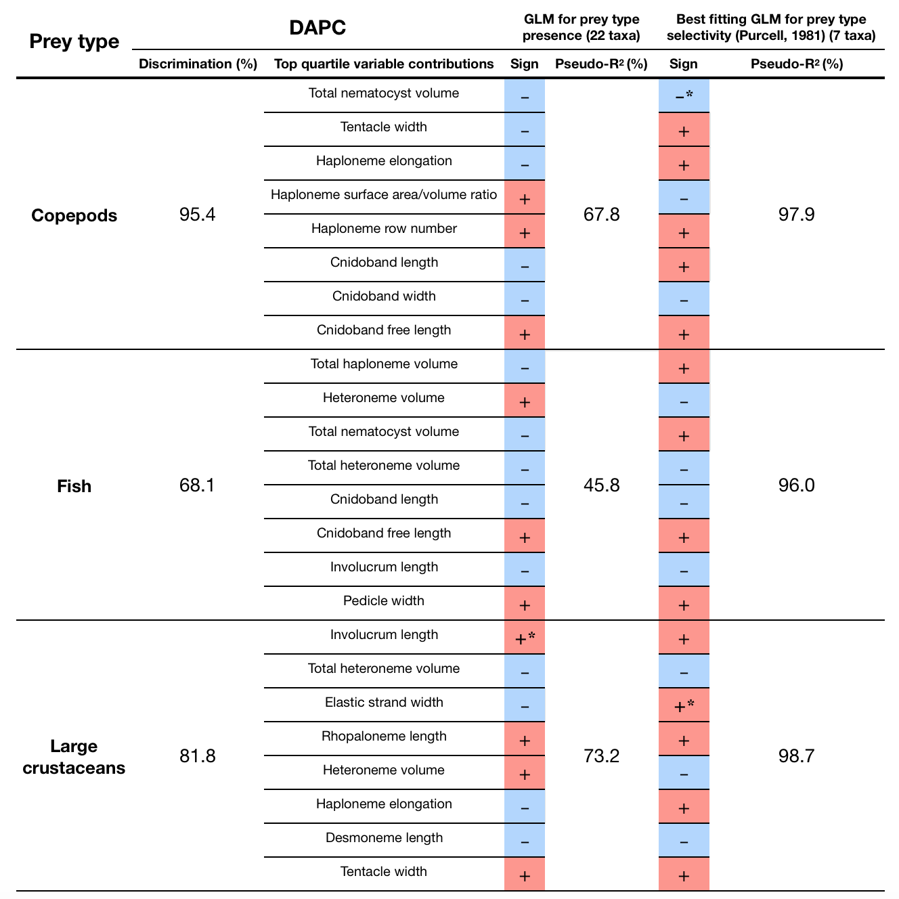

```{r setup, include=FALSE}
	# Load packages
	## General
library(knitr)
library(tidyverse)
library(stringr)
library(reshape2)
	## Biological
library(Rphylip)
library(arbutus)
library(vegan)
library(ape)
library(phangorn)
library(phytools)
library(OUwie)
library(picante)
library(geiger)
library(phylobase)
library(fields)
library(phylosignal)
library(geomorph)
library(phylopath)
library(phylolm)
	## Graphics
library(FactoMineR)
library(factoextra)
library(corrplot)
library(BAMMtools)
library(gridExtra)
library(xtable)
library(colorRamps)

	# Configure knitr, see http://yihui.name/knitr/options
	opts_knit$set(
	  progress=TRUE,
	  verbose=TRUE)
	opts_chunk$set(
	#  include=FALSE,
	  cache=TRUE,
	  echo=FALSE,
	  message=FALSE
	 )
knitr::opts_chunk$set(echo = TRUE)

```

# The Evolution of Siphonophore Tentilla as Specialized Tools for Prey Capture {-}

Alejandro Damian-Serrano^1^^,‡^, Steven H.D. Haddock^2^, Casey W. Dunn^1^

^1^ Yale University, Department of Ecology and Evolutionary Biology, 165 Prospect St., New Haven, CT 06520, USA

^2^ Monterey Bay Aquarium Research Institute, 7700 Sandholdt Rd., Moss Landing, CA 95039, USA

\‡ Corresponding author: Alejandro Damian-Serrano, email: alejandro.damianserrano@yale.edu

## Abstract {-}

Predators have evolved dedicated body parts to capture and subdue prey. As different predators specialize on distinct prey taxa, their tools for prey capture diverge into a variety of adaptive forms. Studying the evolution of predation is facilitated by a predator clade with structures used exclusively for prey capture and with significant morphological variation. Siphonophores, a clade of colonial cnidarians, satisfy these criteria particularly well, capturing prey with their tentilla (tentacle side branches). Earlier work has shown that extant siphonophore diets correlate with the different morphologies and sizes of their tentilla and nematocysts. We hypothesize that evolutionary specialization on different prey types has driven the phenotypic evolution of these characters. To test this hypothesis, we: (1) measured multiple morphological traits from fixed siphonophore specimens using microscopy and high-speed video techniques, (2) built a phylogenetic tree of 45 species, and (3) analyzed the evolutionary associations between siphonophore nematocyst characters and prey type data from the literature. Our results show that siphonophore tentillum structure has strong evolutionary associations with prey type and size specialization, and suggest that shifts between prey-type specializations are linked to shifts in tentillum and nematocyst size and shape. We found that predatory specialists can evolve into generalists, and that specialists on one prey type have directly evolved into specialists on other prey types. In addition, we generated hypotheses about the diets of understudied siphonophore species based on these characters. Thus, the evolutionary history of tentilla shows that siphonophores are an example of ecological niche diversification via morphological innovation and evolution. This study contributes to understanding how morphological evolution has shaped present-day oceanic food webs.

## Keywords {-}

Siphonophores, tentilla, nematocysts, predation, specialization, character evolution

##   {-}

  Most animal predators have characteristic biological tools that they use to capture and subdue prey. Raptors have claws and beaks, snakes have fangs, wasps have stingers, and cnidarians have nematocyst-laden tentacles. The functional morphology of these structures tend to be finely attuned to their ability to successfully capture specific prey [@schmitz2017predator]. Long-term adaptive evolution in response to the defense mechanisms of the prey (*e.g.* avoidance, escape, protective barriers) leads to modifications that can counter those defenses The more specialized the diet of a predator is, the more specialized its tools need to be to meet the specific challenges posed by the prey. Understanding the relationships between predatory specializations and morphological specializations is necessary to contextualize the phenotypic diversity of predators, and to quantify the importance of ecological diversification in generating this diversity.

  Siphonophores (Cnidaria : Hydrozoa) are a clade of organisms bearing modular structures that are exclusively used for prey capture: the tentilla (Fig. \@ref(figure1)). These present a significant morphological variation across species [@mapstone2014global] (Fig. \@ref(figure2)), which makes them an ideal system to study the relationships between functional traits and prey specialization. A siphonophore is a colony bearing many feeding polyps (Fig. \@ref(figure1)), each with a single tentacle, which branches into several tentilla carrying the functional cnidocytes (specialized neural cells carrying nematocysts, the stinging capsules). Unlike most other cnidarians, siphonophores carry their tentacle nematocysts in extremely complex and organized batteries [@skaer1988formation] built into their tentilla. While nematocyst batteries and clusters in other cnidarians are simple static scaffolds for cnidocytes, siphonophore tentilla have their own reaction mechanism, triggered upon encounter with prey. When it fires, a tentillum undergoes an extremely fast conformational change that wraps it around the prey, maximizing the surface area of contact for nematocysts to fire on the prey [@Mackie:1987uy]. In addition, some species have elaborate fluorescent and bioluminescent lures on their tentilla to attract prey with aggressive mimicry [@purcell1980influence;@haddock2005bioluminescent;@haddock2015fluorescent]. Siphonophores bear four major nematocyst types in their tentacles and tentilla. The largest type, heteronemes, have open-tip tubules characterized by bearing a distinctly wider spiny shaft at the proximal end of the everted tubule. These are typically found flanking the proximal end of the cnidoband. The most abundant type, haplonemes, have no distinct shaft, but similarly to heteronemes, their tubules have open tips and can be found in the cnidoband. Both heteronemes and haplonemes bear short spines along the tubule and can be toxic and penetrate the surface of some prey types. In the terminal filament, siphonophores bear two other types of nematocysts, characterized by their adhesive function, closed tip tubules, and lack of spines on the tubule. These are the desmonemes (a type of adhesive coiled-tubule spironeme), and rhopalonemes (a siphonophore-exclusive nematocyst type with wide tubules).

  Many siphonophore species inhabit the deep pelagic ocean, which spans from ~200m to the oceanic seafloor. This habitat has fairly homogeneous physical conditions and stable zooplankton abundances and composition [@robison2004deep]. With a relatively predictable prey availability, ecological theory would predict evolution to drive coexisting siphonophore lineages towards specialization, increasing their feeding efficiencies and reducing interspecific competition [@simpson1944tempo;@hardin1960competitive;@hutchinson1961paradox]. If this prediction holds true, we expect the prey capture apparatus morphologies of siphonophores to diversify with the evolution of increased specialization on a variety of prey types in different siphonophore lineages.

Specialization is often thought to be an evolutionary ‘dead end’, meaning that specialized lineages are unlikely to evolve into generalists or to shift the resource for which they are specialized [@futuyma1988evolution]. However, recent studies have found that interspecific competition can favor the evolution of resource generalism [@stireman2005evolution;@johnson2009competition] and resource switching [@hoberg2008macroevolutionary]. Here we examine three alternative hypotheses on siphonophore trophic specialization: (1) predatory specialists evolved from generalist ancestors; (2) predatory specialists evolved from ancestral predators which specialized on a different resource, switching their primary prey type; and (3) predatory generalists evolved from specialist ancestors.

  The study of siphonophore tentilla and diets has been limited in the past due to the inaccessibility of their oceanic habitat and the difficulties associated with the collection of fragile siphonophores. Thus, the morphological diversity of tentilla has only been characterized for a few taxa, and their evolutionary history remains largely unexplored. Contemporary underwater sampling technology provides an unprecedented opportunity to explore the trophic ecology [@choy2017deep] and functional morphology [@costello2015multi] of siphonophores. In addition, well-supported phylogenies based on molecular data are now available for these organisms [@munro2018improved]. These advances allow for the examination of relationships between modern siphonophore form, function, and ecology, as well as reconstructing their evolutionary history.

  The few pioneering studies that have addressed the relationships between tentilla and diet suggest that siphonophores are a robust system for the study of predatory specialization via morphological diversification. [@purcell1984functions] and [@purcell1988correlation] showed clear relationships between diet, tentillum, and nematocyst characters in co-occurring epipelagic siphonophores. These correlations, while studied for a small subset of extant epipelagic siphonophore species, might be generalizable to all siphonophores. We hypothesize that these relationships reflect correlated evolution between prey selection and tentillum (and nematocyst) traits. Furthermore, we hypothesize that with an extensive characterization of tentilla morphology, we can generate hypotheses about the diets of understudied siphonophore species.
  
In addition, our study design allows us to address other interesting questions about the morphology and evolution of these unique structures. In particular, we aim to address the evolutionary origins of giant tentilla, the character integration of tentilla, the evolution of the extreme shapes of siphonophore nematocysts [@thomason1988allometry], and the mechanical implications of tentillum morphologies on cnidoband discharge.

  In this study, we characterize the morphological diversity of tentilla and their nematocysts across a broad variety of shallow and deep sea siphonophore species using modern imaging technologies, we expand the phylogenetic tree of siphonophores by combining a broad taxon sampling of ribosomal gene sequences with a transcriptome-based backbone tree, and we explore the evolutionary histories and correlations among diet, tentillum, and nematocyst characters.

![\label{figure1} Siphonophore anatomy. A - *Nanomia* sp. siphonophore colony (photo by Catriona Munro). B,C - Illustration of a *Nanomia* colony, gastrozooid, and tentacle (by Freya Goetz). D - *Nanomia* sp. Tentillum illustration and main parts. E - Differential interference contrast micrograph of the tentillum illustrated in D. F - Nematocyst types (illustration reproduced with permission from Mapstone 2014), hypothesized homologies, and locations in the tentillum. Undischarged to the left, discharged to the right.](Figures_final/figure1.jpg)

![\label{figure2} Tentillum diversity plate. The illustrations delineate the pedicle (green), involucrum (blue), cnidoband (orange), elastic strands (pink), terminal structures (yellow). Heteroneme nematocysts (stenoteles in C,E,F,G and mastigophores in H,I) are depicted in red for some species. A - *Erenna laciniata*, 10x. B - *Lychnagalma utricularia*, 10x. C - *Agalma elegans*, 10x. D - *Resomia ornicephala*, 10x. E - *Frillagalma vityazi*, 20x. F - *Bargmannia amoena*, 10x. G - *Cordagalma* sp., reproduced from Carré 1968. H - *Lilyopsis fluoracantha*, 20x. I - *Abylopsis tetragona*, 20x.](Figures_final/figure2.jpg)

## Methods {-}

*Tentillum morphology* – The morphological work was carried out on siphonophore specimens fixed in 4% formalin from the Yale Peabody Museum Invertebrate Zoology (YPM-IZ) collection (accession numbers in Appendix 1). These specimens were collected intact across many years of fieldwork expeditions, using  blue-water diving [@haddock2005scientific], remotely operated vehicles (ROVs), and human-operated submersibles. Tentacles were dissected from non-larval gastrozooids, sequentially dehydrated into 100% ethanol, cleared in methyl salicylate, and mounted onto slides with Canada Balsam or Permount mounting media. The slides were imaged as tiled z-stacks using differential interference contrast (DIC) on an automated stage at YPM-IZ (with the assistance of Daniel Drew and Eric Lazo-Wasem) and with laser point confocal microscopy using a 488 nm Argon laser that excited autofluorescence in the tissues. Thirty characters (defined in Appendix 2) were measured using Fiji [@collins2007imagej;@schindelin2012fiji]. We did not measure the lengths of contractile structures (terminal filaments, pedicles, gastrozooids, and tentacles), since they are too variable to quantify. We measured at least one specimen for 96 different species (Appendix 3, Fig. \@ref(figure3)). Of these, we selected 38 focal species across clades based on specimen availability and phylogenetic representation. Three to five tentacle specimens from each one of these selected species were measured to capture intraspecific variation. 

In order to observe the discharge behavior of different tentilla, we recorded high speed footage (1000-3000 fps) of tentillum and nematocyst discharge by live siphonophore specimens (26 species) using a Phantom Miro 320S camera mounted on a stereoscopic microscope. We mechanically elicited tentillum and nematocyst discharge using a fine metallic pin. We used the Phantom PCC software to analyze the footage. For the 10 species recorded, we measured total cnidoband discharge time (ms), heteroneme filament length (µm), and discharge speeds (mm/s) for cnidoband, heteronemes, haplonemes, and heteroneme shafts when possible (data in Appendix 4). 

*Siphonophore phylogeny* – The phylogenetic analysis included 55 siphonophore species and 6 outgroup cnidarian species (*Clytia hemisphaerica*, *Hydra circumcincta*, *Ectopleura dumortieri*, *Porpita porpita*, *Velella velella*, *Staurocladia wellingtoni*). The gene sequences we used in this study are available online (accession numbers in Appendix 5). Some of the sequences we used were accessioned in [@dunn2005molecular], and others we extracted from the transcriptomes in [@munro2018improved]. Two new 16S sequences for *Frillagalma vityazi* (MK958598) and *Thermopalia* sp. (MK958599) sequenced by Lynne Christianson were included and accessioned to NCBI. We aligned these sequences using MAFFT [@katoh2002mafft] (alignments available in Dryad). We inferred a Maximum Likelihood (ML) phylogeny (Appendix 6) from 16S and 18S ribosomal rRNA genes using IQTree [@nguyen2014iq] with 1000 bootstrap replicates (iqtree -s alignment.fa -nt AUTO -bb 1000). We used ModelFinder [@kalyaanamoorthy2017modelfinder] implemented in IQTree v1.5.5. to assess relative model fit. ModelFinder selected GTR+R4 for having the lowest Bayesian Information Criterion score. Additionally, we inferred a Bayesian tree with each gene as an independent partition in RevBayes [@hohna2016revbayes] (Appendix 7 and 9), which was topologically congruent with the unconstrained ML tree. The *alpha* priors were selected to minimize prior load in site variation.

Given the broader sequence sampling of the transcriptome phylogeny, we ran constrained inferences (using both ML and Bayesian timetree approaches, which produced fully congruent topologies (Appendix 6 and 7)) after fixing the 5 nodes that were incongruent with the topology of the consensus tree in [@munro2018improved]. This topology was then used to inform a Bayesian relaxed molecular clock time-tree in RevBayes, using a birth-death process (sampling probability calculated from the known number of described siphonophore species) to generate ultrametric branch lengths (Appendix 8). Scripts available in Appendix 9.

*Feeding ecology* – We extracted categorical diet data for different siphonophore species from published sources, including seminal papers [@biggs1977field;@purcell1981dietary;@purcell1984functions;@Mackie:1987uy;@pugh1988two;@bardi2007taxonomic;@andersen1981redescription], and ROV observation data [@choy2017deep;@hissmann2005situ] with the assistance of Elizabeth Hetherington and C. Anela Choy (Appendix 10). We removed the gelatinous prey observations for *Praya dubia* eating a ctenophore and a hydromedusa, and for *Nanomia* sp. eating *Aegina*, since we believe these are rare events that have a much larger probability of being detected by ROV methods than their usual prey, and it is not clear whether the medusae were attempting to prey upon the siphonophores. Personal observations on feeding (from SHDH, CAC, and Philip Pugh) were also included for *Resomia ornicephala*, *Lychnagalma utricularia*, *Bargmannia amoena*, *Erenna richardi*, *Erenna laciniata*, *Erenna sirena*, and *Apolemia rubriversa*. In order to detect coarse-level patterns in the feeding habits, the data were merged into feeding guilds. The feeding guilds described here are: small-crustacean specialist (feeding mainly on copepods and ostracods), large crustacean specialist (feeding on large decapods, mysids, or krill), fish specialist (feeding mainly on actinopterygian larvae, juveniles, or adults), gelatinous specialist (feeding mainly on other siphonophores, medusae, ctenophores, salps, and/or doliolids), and generalist (feeding on a combination of the aforementioned taxa, without favoring any one prey group). These were selected to minimize the number of categories while keeping the most different types of prey separate. We extracted copepod prey length data from [@purcell1984functions]. To calculate specific prey selectivities, we extracted quantitative diet and zooplankton composition data from [@purcell1981dietary], matched each diet assessment to each prey field quantification by site, calculated Ivlev’s electivity indices [@jacobs1974quantitative], and averaged those by species (Appendix 11).

*Statistical analyses* – For subsequent comparative analyses, we removed species present in the tree but not represented in the morphology data, and *vice versa*. Although we measured specimens labeled as *Nanomia bijuga* and *Nanomia cara*, we are not confident in some of the species-level identifications, and some specimens were missing diagnostic zooids. Thus, we decided to collapse these into a single taxonomic concept (*Nanomia* sp.). All *Nanomia* sp. observations were matched to the phylogenetic position of *Nanomia bijuga* in the tree. We carried out all phylogenetic comparative statistical analyses in the programming environment R [@team2017r], using the Bayesian ultrametric species tree (Fig. \@ref(figure4)), and incorporating intraspecific variation estimated from the specimen data as standard error whenever the analysis tool allowed it (Appendix 3). R scripts available in Dryad. For each character (or character pair) analyzed, we removed species with missing data and reported the number of taxa included. We tested each character for normality using the Shapiro-Wilk test [@shapiro1965analysis], and log-transformed those that were non-normal.

We fitted different models generating the observed data distribution given the phylogeny for each continuous character using the function fitContinuous in the R package *geiger* [@harmon2007geiger]. The models compared were the white noise (WN; non-phylogenetic model that assumes all values come from a single normal distribution with no covariance structure among species), the Brownian Motion (BM) model of neutral divergent evolution [@martins1996phylogenies], the Early Burst (EB) model of decreasing rate of evolutionary change [@harmon2010early], and the Ornstein-Uhlenbeck (OU) model of stabilizing selection around a fitted optimum state [@uhlenbeck1930theory;@butler2004phylogenetic]. We then ranked the models in order of increasing parametric complexity (WN,BM,EB,OU), and compared the corrected Akaike Information Criterion (AICc) support scores [@sugiura1978further] to the lowest (best) score, using a cutoff of 2 units to determine significantly better support. When the best fitting model was not significantly better than a less complex alternative, we selected the least complex model (Appendix 12). We calculated model adequacy scores using the R package *arbutus* [@pennell2015model] (Appendix 13). We calculated phylogenetic signal in each of the measured characters using Blomberg’s K [@blomberg2003testing] (Appendix 12). We reconstructed ancestral states using Maximum Likelihood (R phytools::anc.ML [@revell2012phytools]), and stochastic character mapping (R phytools::make.simmap) for categorical characters. R scripts available in Dryad.

In order to study the evolution of predatory specialization, we reconstructed components of the diet and prey selectivity on the phylogeny using ML (R phytools::anc.ML). To identify evolutionary associations of diet with tentillum and nematocyst characters, we compared the performance of a neutral evolution model to that of a diet-driven directional selection model. First, we collapsed the diet data into the five feeding guilds mentioned above (fish specialist, small crustacean specialist, large crustacean specialist, gelatinous specialist, generalist), based on which prey types they were observed consuming most frequently. Then, we reconstructed the feeding guild ancestral states using the ML function ace (package ape [@paradis2019package]), removing tips with no feeding data. The ML reconstruction was congruent with the consensus stochastic character mapping (Appendix 18). Then, using the package *OUwie* [@beaulieu2012ouwie], we fitted an OU model with multiple optima and rates of evolution matched to the reconstructed ancestral diet regimes, a single optimum OU model, and a BM null model, inspired by the analyses in [@cressler2015detecting]. Finally, we compared their AICc support values to select the best fitting model (Appendix 14).
  
To model the evolutionary associations between individual tentillum and nematocyst characters and the ability to capture particular prey types in the diet, we ran a series of phylogenetic generalized linear models (R phylolm::phyloglm) (Appendix 17). In addition, we ran a series of comparative analyses to address hypotheses of diet-tentillum relationships posed in the literature. To test for correlated evolution among binary characters, we used Pagel’s test [@pagel1994detecting]. To characterize and evaluate the relationship between continuous characters, we used phylogenetic generalized least squares regressions (PGLS) [@grafen1989phylogenetic]. To compare the evolution of continuous characters with categorical aspects of the diet, we carried out a phylogenetic logistic regression (R nlme::gls using the 'corBrownian' function for the argument ‘correlation’).

To generate hypotheses about the diets of understudied siphonophores for which no feeding observations have yet been reported (but for which we have tentacle morphology data), we carried out linear discriminant analysis of principal components (DAPC) using the dapc function (R adegenet::dapc) [@jombart2010discriminant]. This function allowed us to incorporate more predictors than individuals. We generated discriminant functions for feeding guild, soft/hard bodied prey, and for the presence of copepods, fish, and shrimp (large crustaceans) in the diet (Appendix 15). Some taxa have inapplicable states for certain absent characters (such as the length of a nematocyst subtype that is not present in a species), which are problematic for DAPC analyses. We tackled this by transforming the absent states to zeroes. This approach allows us to incorporate all the data, but creates an attraction bias between small character states (*e.g.* small tentilla) and absent states (*e.g.* no tentilla). Absent characters are likely to be very biologically relevant to prey capture and we believe they should be accounted for in a predictive approach. We limited the number of linear discriminant functions retained to the number of groupings in each case. We selected the number of principal components retained using the a-score optimization function (R adegenet::optim.a.score) [@jombart2010discriminant] with 100 iterations, which yielded more stable results than the cross validation function (R adegenet::xval). This optimization aims to find the compromise value with highest discrimination power with the least overfitting. From these DAPCs we obtained the highest contributing morphological characters to the discriminaton (characters in the top quartile of the weighted sum of the linear discriminant loadings controlling for the eigenvalue of each discriminant). For each DAPC we generated hypotheses about the diets of siphonophores outside the training set (R adegenet::predict.dapc), incorporating prediction uncertainty as posterior probabilities (Appendix 15). In order to identify the sign of the relationship between the predictor characters prey type presence in the diet, we then generated generalized logistic regression models (as a type of generalized linear model, or GLM using R stats::glm) with the top contributing characters (from the corresponding DAPC) as predictors. We also carried out these GLMs on the Ivlev’s selectivity indices for each prey type calculated from [@purcell1981dietary] (in Appendix 11).

In order to explore the correlational structure among continuous characters and among their evolutionary histories, we used principal component analysis (PCA) and phylogenetic PCA [@revell2012phytools]. Since the character dataset contains many gaps due to missing characters and inapplicable states, we carried out these analyses on a subset of species and characters that allowed for the most complete dataset. This was done by removing the terminal filament characters (which are only shared by a small subset of species), and then removing species which had inapplicable states for the remaining characters. In addition, we obtained the correlations between the phylogenetic independent contrasts [@felsenstein1985phylogenies] using the package rphylip [@revell2014rphylip]. 

In order to study correlations between the rates of evolution between different characters, we fitted a set of evolutionary variance covariance matrices [@revell2009phylogenetic] (R phytools::evol.vcv). When fitting all covariance terms simultaneously (Appendix 19.1-20.3), we selected the largest set of characters that would allow the analysis to run without computational singularities. This excluded many of the morphometric characters which are linearly dependent on other characters. Since the functions do not tolerate missing data, we ran the analyses in two ways: One including all taxa but transforming absent states to zeroes, and another removing the taxa with absent states. To test whether phenotypic integration changes across selective regimes determined by the reconstructed feeding guilds, we carried out character-pairwise variance covariance analysis comparing alternative models (R phytools::evolvcv.lite), including those where correlations are the same across the whole tree and models where correlations differ between selective regimes. These analyses could only be carried out on the subset of taxa for which diet data is available, and only among character pairs that are not computationally singular for that taxonomic subset. Finally, we compared regime-specific variance covariance matrices to the general matrix and to their preceding regime matrix to identify the changes in character dependence unique to each regime (see Appendix 19). Gelatinous specialist correlations could only be estimated for a small subset of characters present in *Apolemia*, and should be interpreted with care.

To test how many times extreme nematocyst morphologies evolved, we reconstructed the ancestral states of *log*(length/width) of the different cnidoband nematocyst types, and identified the branches with the greatest shifts. In addition to characterizing the shifts in the state values of haploneme and heteroneme elongation, we identified and located regime shifts for the rate of evolution using a Bayesian Analysis of Macroevolutionary Mixtures (BAMM) [@rabosky2014bamm] (Appendix 16).

## Results {-}


*Phylogeny* – Only 5 nodes (blue dots in Figure \@ref(figure4)) in the unconstrained inference were incongruent with the [@munro2018improved] transcriptome tree, and these were constrained during estimation of the 18S+16S tree. The topology of the constrained tree presented here (Fig. \@ref(figure4)) is congruent with the resolved nodes in [@dunn2005molecular] and [@munro2018improved].

![\label{figure4} Bayesian time-tree built from 18S + 16S concatenated sequences. Branch lengths estimated using relaxed molecular clock. Species names in red indicate replicated representation in the morphology data. Species marked with an asterisk were recorded using high speed video. Nodes labeled with bayesian posteriors (BP). Green circles indicate BP = 1. Blue circles indicate nodes constrained to be congruent with (Munro *et al.* 2018). Tips with black squares indicate the species with transcriptomes used in (Munro *et al.* 2018). Tips with grey squares indicate genus-level correspondence to taxa included in (Munro *et al.* 2018). The main clades are labeled: in black for described taxonomic units, and in grey for operational phylogenetic designations.](Figures_final/figure4.jpg){height=600px}

  We retained the clade nomenclature defined in [@dunn2005molecular] and [@munro2018improved], such as Codonophora to indicate the sister group to Cystonectae, Euphysonectae to indicate the sister group to Calycophorae, Clade A and B to indicate the two main lineages within Euphysonectae. In addition, we define two new clades within Codonophora (Fig. \@ref(figure4)): Eucladophora as the clade containing *Agalma elegans* and all taxa that are more closely related to it than to *Apolemia lanosa*, and Tendiculophora as the clade containing *Agalma elegans* and all taxa more closely related to it than to *Bargmannia elongata*. Eucladophora is characterized by bearing spatially differentiated tentilla with proximal heteronemes and a narrower terminal filament region. The etymology derives from the Greek *eu*+*kládos*+*phóros* for “true branch bearers”. Tendiculophora are characterized by bearing rhopalonemes and desmonemes in the terminal filament, having a pair of elastic strands, and developing proximally detachable cnidobands. The etymology of this clade is derived from the Latin *tendicula* for “snare or noose” and the Greek *phóros* for "carriers".

*Evolutionary dynamics between diet and tentillum morphology* – Reconstructions of feeding guilds shows that generalism is not likely to be ancestral, and it appears to have evolved at least two times independently (Fig. \@ref(figure5)). Large crustacean specialists evolve into generalists twice independently, supporting hypothesis 3. Feeding guild specializations have shifted from an alternative ancestral state at least five times, supporting hypothesis 2. Copepod specialization and fish specialization evolved twice, and ostracod specialization evolved at least once. 

The OUwie model comparison shows that out of 30 characters, 10 show significantly stronger support for the diet-driven multi-optima multi-rate OU model (Appendix 14). These characters include terminal filament nematocyst size and shape, involucrum length, elastic strand width, and heteroneme number. Most of these characters are found exclusively in Tendiculophora, thus this may reflect processes that could be unique to this subtree. Five characters including cnidoband length, cnidoband shape, and haploneme length show maximal support for a diet-driven single-optimum OU model. The remaining 15 characters support BM (or OU with marginal AICc difference with BM).


  Phylogenetic logistic regressions identified evolutionary associations between individual characters and the presence of particular prey types in the diet (Fig. \@ref(figure5), right). Shifts toward ostracod presence in diet correlated with reductions in pedicle width and total haploneme volume. Shifts to copepod presence in the diet were associated with reductions in haploneme width, cnidoband length and width, total haploneme and heteroneme volumes, and tentacle and pedicle widths. Consistently, transitions to decapod presence in the diet correlated with more coiled cnidobands (Appendix 17).

  Phylogenetic regressions of continuous characters against prey selectivity data produced additional insights. Fish selectivity is associated with increased number of heteronemes per tentillum, increased roundness of nematocysts (desmonemes and haplonemes), larger heteronemes, reduced heteroneme/cnidoband length ratios, smaller rhopalonemes, lower haploneme SA/V ratios, and increased size of the cnidoband, elastic strand, pedicle and tentacle widths. Decapod-selective diets were associated with increasing cnidoband size and coiledness, haploneme row number, elastic strand width, and heteroneme number. Copepod-selective diets evolved in association with smaller heteroneme and total nematocyst volumes, smaller cnidobands, rounder rhopalonemes, elongated heteronemes, narrower haplonemes with higher SA/V ratios, and smaller heteronemes, tentacles, pedicles and elastic strands. Selectivity for ostracods was associated with reductions in size and number of heteroneme nematocysts, reductions in cnidoband size, number of haploneme rows, heteroneme number, and cnidoband coiledness. Heteroneme length and elongation also correlated negatively with chaetognath selectivity.

  When some of the diet-morphology associations reported in the literature [@purcell1984functions;@purcell1988correlation] were tested for correlated evolution (Table 1), we found that most were consistent with an evolutionary explanation except the relationship between terminal filament nematocysts (rhopalonemes and desmonemes) and crustaceans in the diet. The latter is likely a product of the larger species richness of crustacean-eating species with terminal filament nematocysts, rather than simultaneous evolutionary gains.

\

Table 1. Tests of correlated evolution between morphological characters and aspects of the diet found correlated in the literature.

```{r tab1, echo=FALSE, out.width='100%'}
knitr::include_graphics('Final_tables/table1.png')
```
\

*Generating dietary hypotheses using tentillum morphology* – The discriminant analysis of principal components for feeding guild (7 principal components, 4 discriminants) produced 100% discrimination, and the highest loading contributions were found for the characters (ordered from highest to lowest): Involucrum length, heteroneme volume, heteroneme number, total heteroneme volume, tentacle width, heteroneme length, total nematocyst volume, and heteroneme width (Appendix 15.1). We used the predictions from this discriminant function to generate hypotheses about the feeding guild of 45 species in our morphological data (Fig. \@(figure6)). This projection predicts that two other *Apolemia* species may also be gelatinous prey specialists like *Apolemia rubriversa*, and that *Erenna laciniata* may be a fish specialist like *Erenna richardi*.

Table 2. Discriminant analysis of principal components for the presence of specific prey types using the morphological data. Top quartile variable (character) contributions to the linear discriminants are ordered from highest to lowest. Logistic regressions and GLMs were fitted to predict prey type presence and selectivity respectively. The sign of the slope of each predictor is reported, marked with an asterisk if significant (p value < 0.05), and highlighted grey if it differs between prey presence in diet and prey selectivity. Pseudo-R^2^ (%) approximates the percent variance explained by the model.

```{r tab2, echo=FALSE, out.width='60%'}

```

  When predicting soft- and hard-bodied prey specialization, the DAPC achieved 90.9% discrimination success, only marginally confounding hard-bodied specialists with generalists (Appendix 15.4). The main characters driving this discrimination are involucrum length, heteroneme number, heteroneme volume, tentacle width, total nematocyst volume, total haploneme volume, elastic strand width, and heteroneme length. Discriminant analyses and GLM logistic regressions were also applied to specific prey type presence and selectivity (Table 2), revealing the sign of their predictive relationship to each prey type. We only selected prey types with sufficient variation in the data to carry out these analyses (copepods, fish, and large crustaceans). While the presence of fish or large crustaceans in the diet cannot be unambiguously discriminated using tentillum morphology (Appendix 15), specialization on fish or large crustacean prey can be fully disentangled (Appendix 15.1). For each prey type studied, tentillum morphology is a much better predictor of prey selectivity than of prey presence in the diet, despite prey selectivity data being available for a smaller subset of species. Interestingly, many of the morphological predictors had opposite slope signs when predicting prey selectivity *versus* predicting prey presence in the diet (Table 2).
  
  

*Evolution of tentillum and nematocyst characters* – One third of the characters measured support a non-phylogenetic generative model, indicating they are not phylogenetically conserved (Appendix 12). Total nematocyst volume and cnidoband-to-heteroneme length ratio showed strongly conserved phylogenetic signals. 74% of characters present a significant phylogenetic signal, yet only total nematocyst volume, haploneme length, and heteroneme-to-cnidoband length ratio had a phylogenetic signal with K > 1. 67% of characters support BM models, indicating a history of neutral constant divergence. No relationship between phylogenetic signal and BM model support was found. Haploneme nematocyst length is the only character with support for an EB model of decreasing rate of evolution with time. No character had support for a single-optimum OU model (when uninformed by feeding guild regime priors).

![\label{figure7} Siphonophore cladogram with the main categorical character gains (green) and losses (red) mapped. Some branch lengths were modified from the Bayesian chronogram to improve readability. The main visually distinguishable tentillum types are sketched next to the species that bear them, showing the location and arrangement of the main characters. In large, complex-shaped euphysonect tentilla, haplonemes were omitted for simplification. The rhizophysid *Bathyphysa conifera* branch was appended manually as a polytomy (dashed line).](Figures_final/figure7.jpg)

The phylogenetic positions of the main categorical character shifts were reconstructed using stochastic character mapping (Appendix 18), and summarized in Figure 7. Haploneme nematocysts are likely ancestrally present in siphonophore tentacles, since they are present in the tentacles of many other hydrozoans. Haplonemes first diverged into spherical isorhizas of 2 size classes in Cystonectae, and elongated anisorhizas of one size class in Codonophora. Haplonemes were likely lost in the tentacles of *Apolemia*, but spherical isorhizas are retained in other *Apolemia* tissues [@siebert2013re]. Similarly, while heteronemes exist in other tissues of cystonects, they appear in the tentacles of codonophorans exclusively, as birhopaloids in *Apolemia*, ancestral stenoteles in eucladophoran physonects, and microbasic mastigophores in calycophorans. 
  
  Eucladophora (the clade containing Pyrostephidae, Euphysonectae, and Calycophorae, see Fig. \@ref(figure4)) encompasses most of the extant Siphonophore species (178 of 186) other than Cystonects and *Apolemia*. Innovations evolved in the stem of this group include spatially segregated heteroneme and haploneme nematocysts, terminal filaments, and elastic strands (Fig. \@ref(figure7)). Pyrostephids evolved a unique bifurcation of the axial gastrovascular canal of the tentillum known as the "saccus" [@totton1965synopsis]. The stem to the clade Tendiculophora (clade containing Euphysonectae and Calycophorae, see Fig. \@ref(figure4)) subsequently acquired further novelties such as the desmoneme and rhopaloneme (acrophore subtype ancestral) nematocysts on the terminal filament (Fig. \@ref(figure7)), which bears no other nematocyst type (Fig. \@ref(figure1)). These are arranged in sets of 2 parallel rhopalonemes for each single desmoneme [@skaer1988formation;@skaer1991remodelling]. The involucrum is an expansion of the epidermal layer that can cover part or all of the cnidoband (Fig. \@ref(figure2)). This structure, together with differentiated larval tentilla, appeared in the stem branch to Clade A physonects. Calycophorans evolved novelties such as larger desmonemes at the distal end of the cnidoband, pleated pedicles with a “hood” (here considered homologous to the involucrum) at the proximal end of the tentillum, anacrophore rhopalonemes, and microbasic mastigophore-type heteronemes. While calycophorans have diversified into most of the extant described siphonophore species (108 of 186), their tentilla have not undergone any major categorical gains or losses since their most recent common ancestor. Nonetheless, they have spreaded over a broad span of variation in nematocyst and cnidoband sizes.

![\label{figure8} A. Correlogram showing strength of ordinary (upper triangle) and phylogenetic (lower triangle) correlations between characters. Both size and color of the circles indicate the strength of the correlation (R^2^). B. Scatterplot of phylogenetic correlation against ordinary correlation showing a strong linear relationship (R^2^ = 0.92, 95% confidence between 0.90 and 0.93). Light red and blue boxes indicate congruent negative and positive correlations respectively. Darker red and blue boxes indicate strong (<-0.5 or >0.5) negative and positive correlation coefficients respectively.](Figures_final/figure8.jpg){height=600px}

*Phenotypic integration of the tentillum* – The quantitative characters we measured from tentilla and their nematocysts are highly correlated. The results indicate that the dimensionality of tentillum morphology is low, that many traits are associated with size, but that nematocyst arrangement and shape are independent of it. Of the phylogenetic correlations (Fig. \@ref(figure8)a, lower triangle), 81.3% were positive and 18.7% were negative, while of the ordinary correlations (Fig. \@ref(figure8)a, upper triangle) 74.6% were positive and 25.4% were negative. Half (49.9%) of phylogenetic correlations were >0.5, while only 3.6% are < -0.5. Similarly, of the across-species correlations, 49.1% were >0.5 and only 1.5% were < -0.5. We found that 13.9% of character pairs had opposing phylogenetic and ordinary correlation coefficients. Just 4% have negative phylogenetic and positive ordinary correlations (such as rhopaloneme elongation ~ heteroneme-to-cnidoband length ratio and haploneme elongation, or haploneme elongation ~ heteroneme number), and only 9.9% of character pairs had positive phylogenetic correlation yet negative ordinary correlation (such as heteroneme elongation ~ cnidoband convolution and involucrum length, or rhopaloneme elongation with cnidoband length). These disparities can be caused by Simpson’s paradox [@blyth1972simpson]: the reversal of the sign of a relationship when a third variable (or a phylogenetic topology [@uyeda2018rethinking]) is considered. However, no character pair had correlation coefficient differences larger than 0.64 between ordinary and phylogenetic correlations (heteroneme shaft extension ~ rhopaloneme elongation has a Pearson’s correlation of 0.10 and a phylogenetic correlation of  -0.54). Rhopaloneme elongation shows the most incongruencies between phylogenetic and ordinary correlations with other characters.

The variance covariance matrices (Appendix 19.1-20.2) are congruent with the abundant positive correlations observed among simple measurement characters in Fig. \@ref(figure8)a. However, this analysis reveals more clearly the diagonal blocks that constitute the evolutionary modules, such as the heteroneme block, the terminal filament nematocyst block, and the cnidoband-pedicle-tentacle block. These results were not very sensitive to transformation of inapplicable states and taxon sampling. When we compared the rate covariance terms between characters across the different feeding guild regimes (Appendix 19.4), we found that half (48%) of the character pairs presented distinct correlation coefficients across different regimes, indicating that the mode of phenotypic integration may also shift with trophic niche. When contrasting the regime-specific rate correlation matrices to the whole-tree matrix, we were able to identify the character dependencies that are unique to each predatory niche (Appendix 19.6).

Under the majority of SIMMAP outcomes, large crustaceans specialists are the first regime to appear, and other regimes evolve in a shift from this ancestral specialization. Compared to the rate correlation matrix estimated over the whole tree, large crustacean specialists present strong negative correlations between haploneme elongation and heteroneme size, and between rhopaloneme elongation and tentillum size, as well as with involucrum length. With the appearance of generalists (*Forskalia* and the *Agalma-Athorybia* clade), terminal filament nematocyst (desmonemes and rhopalonemes) sizes became negatively correlated with the sizes of most characters, meaning that as some tentilla became larger, their individual terminal nematocysts became smaller, observed to the extreme in *Agalma*. In addition, heteroneme and rhopaloneme elongation became positively correlated with cnidoband size. When large crustacean specialists switched to small crustacean prey in *Cordagalma* and calycophorans, haploneme size became inversely correlated with heteroneme elongation, which in turn developed a strong positive relationship with tentillum size. In other words, as tentilla get smaller in this group, heteronemes get shorter and haplonemes get larger. The extremes of this gradient can be seen in *Cordagalma* and *Hippopodius*. With the evolution of fish prey specialization in cystonects and within Clade B, haploneme elongation became negatively correlated with heteroneme elongation (signal driven by Clade B, since cystonects lack tentacular heteronemes), and the surface area to volume ratio of haploneme nematocysts switched from a strong negative relationship with cnidoband size (found in every other regime) to a positively correlation. Gelatinous specialization, albeit appearing only once in our tree, also carries a unique signature in character rate correlation shifts, with an increase in the strength of the correlation between heteroneme shape and shaft width, consistent with the appearance of birrhopaloid nematocysts with swollen shafts that are likely effective at anchoring gelatinous tissue (see reference to Narcomedusae nematocysts in [@purcell1988correlation]).

{height=600px}

  In the non-phylogenetic PCA morphospace using only simple characters (Fig. \@ref(figure9)), PC1 (aligned with tentillum and tentacle size) explained 69.3% of the variation in the tentillum morphospace, whereas PC2 (aligned with heteroneme length, heteroneme number, and haploneme arrangement) explained 13.5%. In a phylogenetic PCA, 63% of the evolutionary variation in the morphospace is explained by PC1 (aligned with shifts in tentillum size), while 18% is explained by PC2 (aligned with shifts in heteroneme number and involucrum length). 

*Evolution of nematocyst shape* – Haploneme nematocyst evolution has been mainly driven by a single large shift towards elongation in Tendiculophora, which contains the majority of described siphonophore species other than Cystonects, *Apolemia*, and Pyrostephidae. There is one secondary return to more oval, less elongated haplonemes in *Erenna*, but it does not reach the sphericity present in Cystonectae or Pyrostephidae (Fig. \@ref(figure10). Heteroneme evolution presents a less discrete evolutionary history, where Tendiculophora evolved more elongate heteronemes, but the difference between theirs and other siphonophores is much smaller than the variation in shape within Tendiculophora, bearing no phylogenetic signal. In this clade, evolution of heteroneme shape has diverged in both directions, and there is no correlation with haploneme shape (Fig. \@ref(figure10)), which has remained fairly constant (elongation between 1.5 and 2.5).  

![\label{figure10} Phylomorphospace showing haploneme and heteroneme elongation (log scaled). Orange area delimits rod-shaped haplonemes, blue area covers oval and round shaped haplonemes. Smaller dots and lines represent phylogenetic relationships and ancestral states of internal nodes under BM. Species nodes in red were manually added to the plot. Cystonects have no tentacle heteronemes and are projected onto the haploneme axis. Apolemiids have no tentacle haplonemes and are projected onto the heteroneme axis. Colored branches and nodes correspond to BAMM regimes of accelerated haploneme shape (green) and heteroneme shape (violet) evolution.](Figures_final/figure10.jpg)

  Haploneme and heteroneme shape share 21% of their variance across extant values, and 53% of variance in their shifts along the branches of the phylogeny. However, much of this correlation is due to the contrast between Pyrostephidae and their sister group Tendiculophora (Fig. \@ref(figure4)). BAMM identified a regime shift in heteroneme shape evolution on the branches leading to *Agalma* and *Athorybia*. For the rates of haploneme shape evolution, BAMM identified two main independent regime shifts (Fig. \@ref(figure10)): one in the branch leading to Codonophora (anisorhizas diverging from cystonects’ spherical isorhizas), and one in the branch leading to Clade B physonects. Clade B includes *Erenna*, *Stephanomia*, *Marrus*, and rhodaliids. Most of these taxa have rod-shaped anisorhizas, but *Erenna* has oval ones). No clear regime shift patterns were identified in the evolution of desmoneme and rhopaloneme shape.

*Functional morphology of tentillum and nematocyst discharge* –  Tentillum and nematocyst discharge high speed measurements are available in Appendix 4. While the sample sizes of these measurements were insufficient to draw reliable statistical results at a phylogenetic level, we did observe patterns that may be relevant to their functional morphology. For example, cnidoband length is strongly correlated with discharge speed (p value = 0.0002). This is probably the sole driver of the considerable difference between euphysonect and calycophoran tentilla discharge speeds (average discharge speeds: 225.0mm/s and 41.8mm/s respectively; t-test p value = 0.011), since the euphysonects have larger tentilla than the calycophorans among the species recorded.

  We also observed that calycophoran haploneme tubules fire faster than those of euphysonects (T-test p value = 0.001). Haploneme nematocysts discharge 2.8x faster than heteroneme nematocysts (T-test p value = 0.0012). Finally, we observed that the stenoteles of the Euphysonectae discharge a helical filament that “drills” itself through the medium it penetrates as it everts.

## Discussion {-}
  The core aims of this study are to examine the evolutionary history of siphonophore tentilla and diet, characterize the evolutionary shifts in their trophic niches, and identify the morphological characters that evolve with changes in prey type. We inquire whether the relationships between form and function observed in extant taxa are due to correlated evolution or non-evolutionary causes, whether the evolution of their trophic specializations supports or challenges traditional ecological theory (such as the idea specialists evolve from generalists), and whether the diets of siphonophores can be hypothesized by observing their tentacles. In addition, we produced novel findings on tentillum morphology, siphonophore phylogeny, nematocyst character evolution, and tentillum discharge dynamics.

*Evolution of tentillum morphology with diet* – Siphonophores are an abundant group of zooplankton in oceanic ecosystems [@longhurst1985structure;@o2007copepod]. While little is known about siphonophore trophic ecology, what is known indicates that they occupy a central position in midwater food webs [@choy2017deep], serving as trophic intermediaries between smaller zooplankton and higher trophic level predators. Siphonophore species have been observed to feed on a variety of prey with very different sizes, traits, and behaviors. Because there is a total absence of siphonophores in the fossil record, how they became established as the ubiquitous and diversified predators in today’s oceans remains an open question. Predators that use morphologically similar tools for prey capture tend to capture similar prey, thus their abundance and coexisting species diversity are inversely related due to competitive exclusion by resource limitation [@schluter2000ecological]. However, this is not consistent with what we observe in siphonophores, which have been found to be both very abundant and locally diverse [@longhurst1985structure, @mapstone2014global]. We hypothesize that siphonophores have escaped this by specializing on different prey resources.

According to our reconstructions, the evolutionary history of siphonophore diets indicates that being a specialist was an ancestral aspect of their trophic niche, while trophic generalism is likely a derived condition. Several studies (reviewed in [@futuyma1988evolution]) have suggested that resource specialization is an irreversible dead end due to the constraints posed by phenotypic specialization. Our reconstructions show that this is not the case for siphonophores, where the prey type on which they specialize has shifted at least 5 times, and generalism has evolved independently at least twice. Among the evolutionary hypotheses considered, we find support for both hypotheses 2 (specialist resource switching) and 3 (specialist to generalist), but no support for hypothesis 1 (generalist to specialist). The evolutionary history of tentilla shows that siphonophores are an example of trophic niche diversification via morphological innovation and evolution, which allowed transitions between specialized trophic niches. This strategy is particularly important in a deep open ocean ecosystem, which is a relatively homogeneous physical environment, where the primary niche heterogeneity available is the potential interactions between organisms [@robison2004deep].

  One of the most common prey items found in siphonophore diets is copepods (Fig. \@ref(figure5)). Copepod-specialized diets have evolved convergently in *Cordagalma* and some calycophorans. These evolutionary transitions happened together with transitions to smaller tentilla with fewer cnidoband nematocysts. Tentilla are expensive single-use structures, therefore we would expect that specialization in small prey would beget reductions in the size of the prey capture apparatus to the minimum required for the ecological performance. *Cordagalma*’s tentilla strongly resemble the larval tentilla (only found in the first-budded feeding body of the colony) of their sister genus *Forskalia* spp. This indicates that the evolution of *Cordagalma* tentilla could be a case of paedomorphosis associated with predatory specialization on smaller prey.
	
[@purcell1984functions] showed that haplonemes have a penetrating function as isorhizas in cystonects and an adhesive function as anisorhizas in Tendiculophora. The two clades that have been observed primarily feeding on fish (Cystonectae and Clade B, which includes *Erenna*, *Stephanomia*, *Marrus*, and rhodaliids) present an accelerated rate of haploneme shape evolution towards more compact haplonemes, significantly distinct from their closest relatives. Isorhizas in cystonects are known to penetrate the skin of fish during prey capture, and to deliver the toxins that aid in paralysis and digestion [@hessinger1988nematocyst]. *Erenna* anisorhizas are also able to penetrate human skin and deliver a painful sting [@pugh2001review] (and pers. obs.), a common feature of piscivorous cnidarians like cystonects or cubozoans.
	
[@thomason1988allometry] hypothesized that smaller, more spherical nematocysts, with a lower surface area to volume ratio, are more efficient in osmotic-driven discharge and thus have more power for skin penetration. The elongated haplonemes of crustacean-eating Tendiculophora have never been observed penetrating their crustacean prey ([@purcell1984functions] and our unpublished observations), and are hypothesized to entangle the prey through adhesion of the abundant spines to the exoskeletal surfaces and appendages. Entangling requires less acceleration and power during discharge than penetration, as it does not rely on point pressure. In fish-eating cystonects and *Erenna* species, the haplonemes are much less elongated and very effective at penetration, in congruence with the osmotic discharge hypothesis.

When we tested the diet-morphology correlation hypotheses supported in the literature from a macroevolutionary perspective (Table 1), we found that most of them were consistent with correlated evolution. The ecomorphological association between rhopalonemes, desmonemes, and crustacean eaters was not congruent with a scenario of correlated evolution. This is probably due to the broader set of taxa in our analyses, including multiple species without desmonemes or rhopalonemes but which effectively capture crustaceans (such as *Cordagalma ordinatum*, *Lychnagalma utricularia*, and *Bargmannia amoena*).
	
While our results unambiguously show that tentillum morphology evolved with diet, the conclusions we can draw from these analyses are limited by the sparse dietary data available. Moreover, our analyses are not sufficient to adequately test hypotheses of adaptation, since that would require evidence of changes within a population exposed to different selective pressures. When interpreting these results, it is important to remember that diet is a product of environmental prey availability and predator selectivity. Selectivity differences across siphonophore species could be driven by other phenotypes not accounted for this study. For example, tentacle-deploying behavior, positioning in the water column, sensitivity thresholds for nematocyst discharge, or chemical cues to ingest a captured animal. Further observations on these behaviors in the field are necessary to assess their relative importance in determining dietary composition. In addition to behavior, there is much biochemistry in the prey capture and digestion processes that remains unexplored. Part of the success in siphonophore prey capture is likely determined by the effectivity of the toxins delivered by the nematocysts on different taxa. Comparative toxin assays and venom protein evolution studies would shed light on this question. Moreover, siphonophore trophic specialization may have brought changes in the digestive biochemistry of gastrozooids and palpons. A comparison of the gene expression levels for different enzymes in the gastrozooids of different species, together with digestive enzyme sequence evolution studies, and a toxicological assay of the different venoms in siphonophore nematocysts on different prey taxa, would provide a great complement to our results.

*Generating hypotheses on siphonophore feeding ecology* – One motivation for our research was to understand the links between predator capture tools and their diets so we can generate hypotheses about the diets of siphonophores based on morphological characteristics. Indeed, our discriminant analyses were able to distinguish between different siphonophore diets based on morphological characters alone. The models produced by these analyses generated testable predictions about the diets of many species for which we only have morphological data of their tentacles. While the limited dataset used here is informative for generating tentative hypotheses, the empirical dietary data are still scarce and insufficient to cast robust predictions. This reveals the need to extensively characterize siphonophore diets and feeding habits. In future work, we can test these ecological hypotheses and validate these models by directly characterizing the diets of some of those siphonophore species. Predicting diet using morphology is a powerful tool to reconstruct food web topologies from community composition alone. In many of the ecological models found in the literature, interactions among the oceanic zooplankton have been treated as a black box [@mitra2009closure]. The ability to predict such interactions, including those of siphonophores and their prey, will enhance the taxonomic resolution of nutrient-flow models constructed from plankton community composition data.

*Phenotypic integration of siphonophore tentilla* – Many tentillum characters, such as nematocysts, arose from the subfunctionalization of serial homologs [@david2008evolution]. Serial homologs have shared genetic elements underlying their development, and are expected to have phylogenetic correlations [@wagner2000evolutionarily]. In addition, these sub-structures must fit and work together in synchrony to ensnare prey successfully (functional integration). Character complexes that satisfy these conditions tend to be phenotypically integrated. Phenotypic integration is the set of functional and genetic correlations among the traits of an organism [@pigliucci2003phenotypic]. These correlations have been hypothesized to direct and constrain adaptive evolution [@wagner2000evolutionarily]. The siphonophore tentillum morphospace has a fairly low extant dimensionality due to an evolutionary history with many synchronous, correlated changes. This is consistent with strong phenotypic integration where genetic and developmental correlations are maintained by natural selection to preserve function. 

  Structural correlations within the tentillum are expected from shared regulatory networks within a common developmental bud (budding tentilla in the tentacle). Similarly, correlations between nematocyst subtypes are also expected given their common evolutionary and developmental origin. None of these explanations for correlated evolution are surprising, nor require natural selection. However, we also found correlations between nematocyst and tentillum characters. Siphonophore tentacle nematocysts (in their cnidocytes) are not produced nor matured in the developing tentillum. These cnidocytes are produced by dividing cnidoblasts in the basigaster (basal swelling of the gastrozooid). Once the cnidocytes have assembled the nematocyst, they migrate outward along the tentacle [@carre1972study] and position themselves in the tentillum according to their type and size [@skaer1988formation]. Thus, the developmental programs that produce the observed nematocyst morphologies are spatially separated from those producing the tentillum morphologies. Therefore, we hypothesize the genetic correlations and phenotypic integration between tentillum and nematocyst characters are maintained through natural selection on separate regulatory networks, out of the necessity to work together and meet the spatial, mechanical, and functional constraints of their prey capture behavior.
  
  Our evolutionary rate covariance results indicate that tentilla are not only phenotypically integrated, but also show patterns of evolutionary modularity, where different sets of characters appear to evolve in stronger correlations among each other than with other characters. This may be indicative of the underlying genetic and developmental dependencies among closely homologous nematocyst types (such as desmonemes and rhopalonemes) and structures. In addition, these evolutionary modules point to hypothetical functional modules. For example, the coiling degree of the cnidoband and the extent of the involucrum have correlated rates of evolution, while high speed videos show that the involucrum helps direct the whiplash of the uncoiling cnidoband forward (towards the prey).

  While selection acting on character states is a widely studied phenomenon, recent studies have shown that selection can also act upon the patterns of character correlations and phenotypic dependencies [@young2005serial;@goswami2006morphological;@revell2009phylogenetic;@monteiro2010adaptive;@hallgrimsson2012generation;@claverie2013modularity;@caetano2018estimating]. This evolution of character relationships can allow lineages to explore new regions of the morphospace and facilitate the appearance of ecological novelties. Our results show that the patterns of phenotypic integration in siphonophore tentilla vary among clades, and appear to display different relationships across shifting feeding specializations.  Similarly to what has been found in the feeding morphologies of fish [@collar2005comparative;@revell2009phylogenetic], siphonophore tentilla may have accommodated new diets by altering the correlations between characters. For example, changes in the size and shape relationships between nematocyst types gave rise to the nematocyst complements specialized in ensnaring small crustaceans or fish. Finally, the evolvability of phenotypic dependencies likely had a large role in the evolution of the diverse tentilla morphologies we observe today across siphonophores.

*Evolutionary history of tentillum morphology* – This study produced the most speciose siphonophore molecular phylogeny to date, while incorporating the most recent findings in siphonophore deep node relationships. This phylogeny revealed for the first time that the genus *Erenna* is the sister to *Stephanomia amphytridis*. *Erenna* and *Stephanomia* bear the largest tentilla among all siphonophores, thus their monophyly indicates that there was a single evolutionary transition to giant tentilla. Siphonophore tentilla range in size from ~30 µm in some *Cordagalma* specimens to 2-4 cm in *Erenna* species, and up to 8 cm in *Stephanomia amphytridis* [@pugh2014review]. Most siphonophore tentilla measure between 175 and 1007 µm (1st and 3rd quartiles), with a median of 373 µm. The extreme gain of tentillum size in this newly found clade may have important implications for access to large prey size classes.

  Tentillum size, as well as the majority of the characters studied, supported BM evolutionary models. There are two alternative hypotheses about the generative process of BM. One hypothesis would suggest that these characters are not under selection, and therefore diverging neutrally [@lande1976natural]. The second hypothesis suggests that they are under selection, but the adaptive landscape was rapidly shifting [@hansen1996translating], without leaving clear patterns across the phylogeny. Some of the BM supported characters are likely to have evolved under the second hypothesis, since when a diet-driven regime tree was provided, these characters preferentially supported an OU model (Appendix 14). 

  Siphonophore tentilla are defined as lateral, monostichous evaginations of the tentacle gastrovascular lumen with epidermal nematocysts [@totton1965synopsis]. The buttons on *Physalia* tentacles were not traditionally regarded as tentilla, but [@bardi2007taxonomic] and our observations [@munro2018improved], confirm that the buttons contain evaginations of the gastrovascular lumen, thus satisfying all the criteria for the definition. In this light, and given that most Cystonectae bear conspicuous tentilla, we conclude (in agreement with [@munro2018improved]) that tentilla are likely ancestral to all siphonophores, and secondarily lost in *Apolemia* and *Bathyphysa conifera*.
  
  The clade Tendiculophora contains far more species than its relatives Cystonectae, Apolemiidae, and Pyrostephidae. An increase in clade richness and ecological diversification can be triggered by a ‘key innovation’ [@simpson1955major]. The evolutionary innovation of the Tendiculophora tentilla with shooting cnidobands and modular regions may have facilitated further dietary diversification. In addition, our work identifies an interesting example of convergent evolution. The region of the tentillum morphospace (Fig. \@ref(figure9)) occupied by calycophorans was independently (and more recently) occupied by the physonect *Frillagalma vityazi*. Like calycophorans, *Frillagalma* tentilla have small C-shaped cnidobands with a few rows of anisorhizas. Unlike calycophorans, they lack paired elongate microbasic mastigophores. Instead, they bear three elongated stenoteles, and their cnidobands are followed by a branched vesicle, unique to this genus. Their tentillum morphology is very different from that of other related physonects, which tend to have long, coiled, cnidobands with many paired oval stenoteles. Most studies on calycophoran diets have reported their prey to be primarily composed of small crustaceans, such as copepods or ostracods [@purcell1981dietary;@purcell1984functions]. The diet of *Frillagalma vityazi* is unknown, but this morphological convergence suggests that they evolved to capture similar kinds of prey. Our DAPCs predict that *Frillagalma* has a generalist niche with both soft and hard bodied prey, including copepods.

*Evolution of nematocyst shape* –  The phylogenetic placement of siphonophores among the Hydrozoa remains an unresolved question [@munro2018improved]. The most recent work on this front sets them as sister group to all other Hydroidolina [@kayal2015phylogenetic]. Therefore, there is a great uncertainty around the ancestral plesiomorphies of the common ancestor of all siphonophores. This is especially true for those characters that present extreme differences between Cystonectae and Codonophora (the earliest split in the siphonophore phylogeny). One such character is the shape of haploneme nematocysts. A remarkable feature of siphonophore haplonemes is that they are outliers to all other Medusozoa in their surface area to volume relationships, deviating significantly from sphericity [@thomason1988allometry]. This suggests a different mechanism for their discharge that could be more reliant on capsule tension than on osmotic potentials [@carre1980triggering], and strong selection for efficient nematocyst packing in the cnidoband [@thomason1988allometry;@skaer1988formation]. Our results show that Codonophora underwent a shift towards elongation and Cystonectae towards sphericity, assuming the common ancestor had an intermediate state. Since we know that the haplonemes of other hydrozoan outgroups are generally spheroid, it is more parsimonious to assume that cystonects retain this ancestral state. Later, we observe a return to more rounded (ancestral) haplonemes in *Erenna*, concurrent with a secondary gain of a piscivorous trophic niche, like that exhibited by cystonects.

In parallel with haploneme shape, heteroneme shape evolution also presents a single, large, early transition towards elongation. While cystonects do not bear heteronemes in their tentacles, *Physalia physalis* bears stenoteles in other zooids [@totton1965synopsis], hypothetically used for defense rather than for prey capture. These stenotele heteronemes are rounded like those found in pyrostephids and apolemiids, which is consistent with the story of a single transition leading to the elongated heteronemes in the stem of Tendiculophora. 

  The implications of these results to the evolution of nematocyst function are that an innovation in the discharge mechanism of haplonemes may have occurred during the main shift to elongation. Elongate nematocysts can be tightly packed into cnidobands. We hypothesize this may be a Tendiculophora lineage-specific adaptation to packing more nematocysts into a limited tentillum space, as suggested by [@skaer1988formation]. Tendiculophora, comprised of the clades Euphysonectae and Calycophorae, includes the majority of siphonophore species. Among these, are the most abundant siphonophore species, and a greater morphological and ecological diversity is found. We hypothesize that this packing-efficient haploeme morphology may have been a key innovation leading to the diversification of this clade. However, other characters that shifted concurrently in the stem of this clade may have been responsible for their extant diversity.
  
Some siphonophore clades have more nematocyst types than others in the tentacles (Tendiculophora has 4 types, Cystonectae and Apolemiidae have 1), or different subtypes (e.g. stenoteles, mastigophores, birhopaloids). In addition to the tentacles, siphonophores may bear nematocysts in other parts of the colony (gastrozooids, papons, palpacles, bracts, nectophores, and gonozooids) [@totton1965synopsis]. In this paper we only look at the presence of nematocyst types in the tentacles, therefore the gains and losses reported are not necessarily morphological innovations, but developmental allocations. Nonetheless, siphonophores have evolved unique nematocyst types and subtypes, not present in any other cnidarian, such as the two types of rhopalonemes (acrophores and anacrophores), and the haploneme homotrichous anisorhizas [@werner1965nesselkapseln]. Both these nematocyst types evolved in the stem to Tendiculophora, and are likely morphological innovations, since they have not yet been found in any other tissue of any other organism. The gain of extreme elongation in the haplonemes of Tendiculophora can be interpreted as part of the character shift to a novel anisorhiza subtype.

*Diversity of discharge dynamics* – A fundamental corollary in functional morphology is that structural morphology determines functional performance [@wainwright1994ecological]. We expected the discharge dynamics exhibited by siphonophore tentilla should vary with their morphological diversity. Our results are consistent with this expectation, and we observe, for example, that cnidoband size largely correlates with cnidoband discharge speed. This suggests that prey escape response speed may determine the minimum cnidoband length for successful capture.

*Insights from tentillum morphology* – The measurements taken illustrate that the morphological diversity of siphonophore tentilla and nematocysts is remarkable, both in their range of shapes and sizes, as in the dimensions and subtypes of the nematocysts they bear. Siphonophores bear the largest nematocysts among Hydrozoans. The largest nematocysts in our dataset (*Bargmannia lata* by volume and *Resomia dunni* by length), are the largest of all nematocysts reported for cnidarians, and therefore possibly the largest intracellular organelles among all living things.

  In addition to the insights produced in this study, the newly collected morphological data provide a unique resource for future studies, and a reference dataset for siphonophore identification. Many conspicuous categorical characters in siphonophore tentilla are singularly diagnostic, such as: the fluorescent lures of *Resomia ornicephala*, the bioluminescent lures of *Erenna* species, the unique branched vesicle of *Frillagalma vityazi*, the buoyant medusa-resembling vesicle of *Lychnagalma* with 8 pseudo-tentacles, the zig-zag morphology of *Resomia* species, the inverted orientation of *Physophora* cnidobands, the button-like tentilla of *Physalia*, or the acorn-shaped minute tentilla of *Cordagalma* species (Fig. \@ref(figure7)). Some categorical characters are synapomorphic diagnostic characters for large clades, such as the proximal tentillum heteronemes of Eucladophora, the elastic strand, rhopalonemes, and desmonemes of Tendiculophora, the larval tentilla of Euphysonectae, the two-sized isorhizas of Cystonectae, the saccus canal of Pyrostephidae, or the seven rows of anisorhizas in Calycophorae. These characters should be used together with the classical nectophore and bract characters to identify species or at least impute phylogenetic affiliation from incomplete material.

## Conclusions {-}

  Siphonophores have diverse predatory niches in the open ocean, ranging from mid-trophic small crustacean eaters to piscivorous super-carnivores. With the evolution of diversified prey type specializations comes the evolution of morphologies adapted to the challenges posed by different prey. The results presented here indicate that the associations found between siphonophore tentilla and their prey are a product of correlated evolution in highly integrated traits. While much of the literature focuses on how predatory generalists evolve into predatory specialists, in siphonophores we find predatory specialists can evolve into generalists, and that specialists on one prey type have directly evolved into specialists on other prey types. Our extended morphological characterization shows that the relationships between form and ecology hold across a large set of taxa and characters, and can be used to generate hypotheses on the feeding habits of uncharacterized species. We find that the evolutionary diversification of tools for prey capture contributed to the diversification of trophic interactions. Therefore, we identify organismal trait evolution as a key driver in the emergence of food web complexity.
  
## Supplementary Materials {-}

Data available from the Dryad Digital Repository: [http://dx.doi.org/10.5061/dryad.NNNN](http://dx.doi.org/10.5061/dryad.[NNNN])
Online Appendices are available in [https://github.com/dunnlab/tentilla_morph/Supplementary_materials/Online_Appendices](https://github.com/dunnlab/tentilla_morph/Supplementary_materials/Online_Appendices)

## Funding {-}

  This work was supported by the Society of Systematic Biologists (Graduate Student Award to A.D.S.); the Yale Institute of Biospheric Studies (Doctoral Pilot Grant to A.D.S.); and the National Science Foundation (Waterman Award to C.W.D., and NSF-OCE 1829835 to C.W.D., S.H.D.H., and C. Anela Choy). A.D.S. was supported by a Fulbright Spain Graduate Studies Scholarship.

## Acknowledgements {-}

We wish to thank the crew and scientists of the R/V Western Flyer, who participated in the collection of many of the specimens used in this study. We also want to thank Lynne Christianson and Shannon Johnson from the Monterey Bay Aquarium Research Institute for their assistance in the field as well as for sequencing some of the species included in this phylogeny. In addition, we wish to thank Lourdes Rojas, Daniel Drew, and Eric Lazo-Wasem for their assistance in imaging the fixed specimens and managing the collections. We thank Dennis Pilarczyk for organizing the prey selectivity data, Michael Landis for helping design the Bayesian analyses, and Joaquin Nunez for reviewing this manuscript. Furthermore, we thank Elizabeth D. Hetherington and C. Anela Choy for collating the data on siphonophore feeding and for reviewing the manuscript. Finally, we thank Philip Pugh, who confirmed many of our specimen identifications and taught us valuable knowledge about siphonophores.

## References {-}

